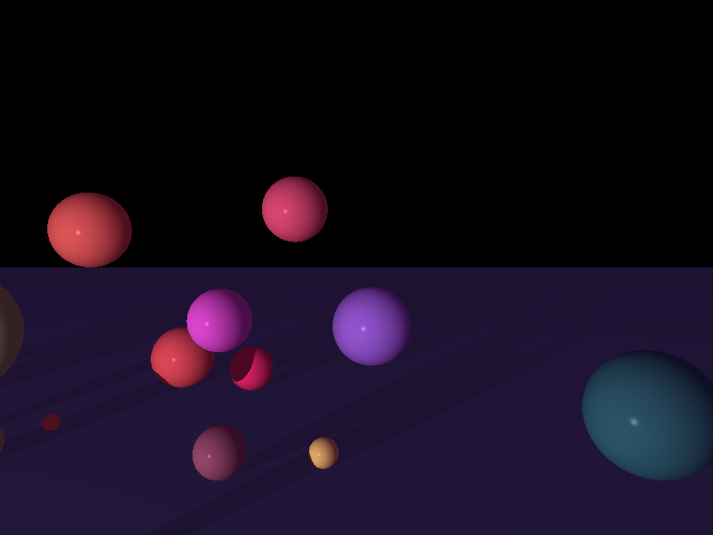
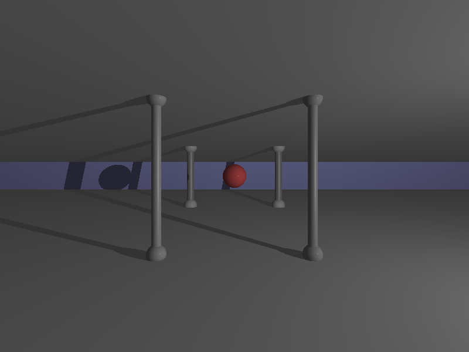
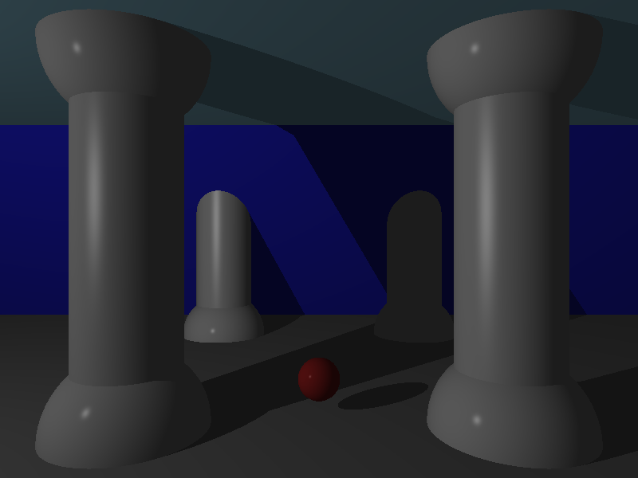

# miniRT

A ray tracing engine written from scratch in C as part of the 42 curriculum, focused on understanding the mathematical and systems-level foundations of computer graphics.

The project implements a complete rendering pipeline capable of generating 3D scenes with lighting, shadows, reflections, and geometric intersections using ray tracing principles.

<p align="center">
  
</p>

---

## Motivation

miniRT was an opportunity to explore how rendering engines work internally by building the core systems from first principles.

The project focused heavily on:
- linear algebra,
- ray-object intersections,
- transformation pipelines,
- lighting models,
- and spatial reasoning in 3D environments.

Rather than relying on existing rendering frameworks, the goal was to better understand the mathematics and architecture behind modern graphics systems.

---

## Rendering Pipeline Overview

```text
Camera
   ↓
Ray Generation
   ↓
Object Intersection Tests
   ↓
Surface Normal Calculation
   ↓
Lighting & Shadow Evaluation
   ↓
Pixel Color Output
   ↓
Rendered Scene
```

---

## Implemented Features

### Geometric Primitives
- Spheres
- Planes
- Cylinders with caps

### Lighting
- Ambient lighting
- Diffuse lighting
- Specular highlights
- Hard shadows

### Camera System
- Configurable field of view
- Arbitrary positioning and orientation
- View transformations

### Transformations
- Translation
- Rotation
- Scaling
- Matrix-based object transformations

### Scene Parsing
- Custom `.rt` scene format
- Object/material configuration
- Camera and lighting setup

---

## Technical Challenges

Some of the most challenging parts of the project included:
- implementing reliable ray-object intersection logic,
- debugging transformation matrices,
- handling numerical precision edge cases,
- managing object-space vs world-space transformations,
- and building a clean rendering architecture entirely in C.

The mathematical side of the project — especially matrix operations, vector math, and spatial transformations — became one of the most rewarding aspects of the implementation.

---

## Example Scenes

<p align="center">
  
  
</p>

Example scenes include:
- simple lighting demonstrations,
- reflective spheres,
- cylinder-based scenes,
- and more complex object compositions.

---

## Build Instructions

### Requirements

- GCC or Clang
- CMake
- GLFW / OpenGL dependencies

### Build

```bash
make
```

### Run

```bash
./miniRT <scene.rt>
```

Example:

```bash
./miniRT scenes/pokeball.rt
```

---

## Future Improvements

- Reflections and recursive ray tracing
- Refraction and transparency
- Texture mapping
- Anti-aliasing
- BVH acceleration structures
- Multi-threaded rendering

---

## Authors

- [Simon Wied](https://github.com/AimonKied)
- Frederick Charbonnier

---

## License

Developed as part of the 42 curriculum.
